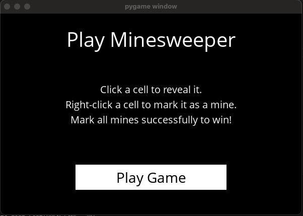
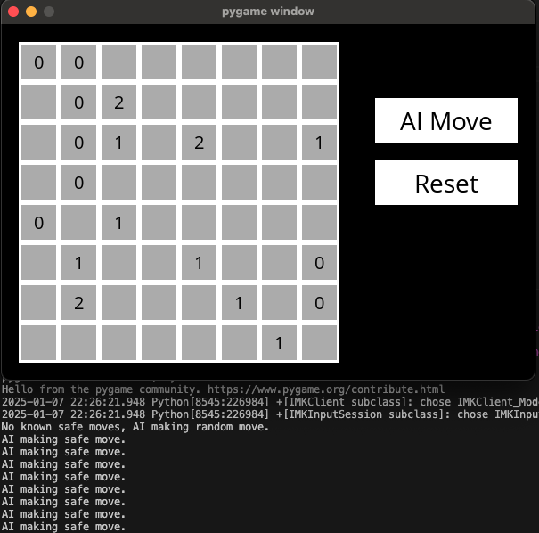

# CS50 AI Course: Problem Set 1 – Minesweeper

This repository contains the solution to **Problem Set 1: Minesweeper** from **CS50’s Introduction to Artificial Intelligence with Python**. The project involves building an AI agent that can play the game of Minesweeper using logical inference.

---

## Example Gameplay

 

## Project Overview

The project is divided into two main components:

1. **`minesweeper.py`**: Implements the Minesweeper game and the AI agent.
2. **`runner.py`**: Provides a graphical interface using **Pygame** where users can play the game and watch the AI make moves.

---

## How the Program Works

### **1. Minesweeper Game**

- The board is represented as an 8x8 grid with 8 randomly placed mines.
- The player can click cells to reveal them or right-click to flag them as mines.
- The game ends when all mines are correctly flagged or when a mine is clicked.

### **2. Minesweeper AI**

The AI agent uses **logical inference** to deduce safe cells and mine locations by maintaining a knowledge base of sentences. Each sentence consists of a set of cells and the number of mines among them.

Key AI functionalities include:
- **Marking cells as safe or mines** based on known information.
- **Adding new knowledge** when a cell is revealed, updating the knowledge base accordingly.
- **Inferring new information** by comparing sentences to deduce additional safe cells or mines.

The AI can make two types of moves:
1. **Safe Move**: If a safe move is known, the AI makes it.
2. **Random Move**: If no safe move is known, the AI makes a random move on a cell that hasn’t been flagged or revealed.

---

## Key Components

### **`minesweeper.py`**

This file defines the Minesweeper game and the AI agent. Key classes include:

- **`Minesweeper`**: Represents the game board, places mines, and tracks the player's progress.
- **`Sentence`**: Represents a logical statement about the game (a set of cells and the number of mines among them).
- **`MinesweeperAI`**: Implements the AI logic for making moves and updating knowledge based on revealed cells.

### **`runner.py`**

This file uses **Pygame** to create a graphical user interface (GUI) for the game. It allows the player to interact with the game and watch the AI make moves.

---

